# Architecture

## Processing Core

The core processing engine is composed of four layers: a logical planning layer, a stage layer, a task layer, and a DistCollection layer.

### 1. Planning Layer

- Lazy, immutable representation of what will be computed.
- Essentially a declarative statement for what operations are applied, organized into a computation graph

```scala
// This creates a Plan tree, no computation happens yet
val plan = Plan.MapOp(
  Plan.FilterOp(
    Plan.Source(partitions), 
    x => x > 2
  ), 
  x => x * 2
)
```

### 2. Stage Layer

- Groups narrow transformations together for efficient execution
- Each stage can execute multiple operations in a single pass over the data
- Stage boundaries occur at wide transformations (shuffles) or unions

```scala
// A stage that chains map and filter operations
val stage = Stage.ChainedStage(
  Stage.map(x => x * 2),
  Stage.filter(x => x > 4)
)
val result = stage.execute(partition) // Executes both operations in one pass
```

### 3. Task Layer

- Computation is broken down into actual execution units over a single piece of data (partition). One task always runs on exactly one partition.
- Uses `StageTask` that can execute entire stages (multiple chained operations)
- Computation is actually triggered with `task.run()`

```scala
val task = Task.StageTask(partition, stage)
val result = task.run() // Actually executes the entire stage
```

### 4. DistCollection Layer (User API)

- High-level API that users interact with

```scala
val dc = DistCollection(data, 2)
  .map(_ * 2)     // Creates Plan.MapOp
  .filter(_ > 4)  // Creates Plan.FilterOp
  .collect()      // Triggers execution via Tasks
```

## Example Walkthrough
User writes code with DistCollection API
```scala
// User code:
val result = DistCollection(Seq(1,2,3,4), 2)
  .map(_ * 2)
  .filter(_ > 4)
  .collect()
```

Step 1: Plan Creation
```scala
// DistCollection.map() creates:
Plan.MapOp(Plan.Source([Partition([1,2]), Partition([3,4])]), x => x * 2)

// DistCollection.filter() creates:
Plan.FilterOp(Plan.MapOp(...), x => x > 4)
```

Step 2: Stage Creation
```scala
// Executor.createTasks() first calls StageBuilder.buildStages(),
// which groups narrow transformations:
// The map and filter are combined into a single stage:
val stage = Stage.ChainedStage(
  Stage.map(x => x * 2),
  Stage.filter(x => x > 4)
)
// Result: [(Source, stage)] - one stage that does both operations
```

Step 3: Task Creation
```scala
// Executor.createTasks() converts stages to tasks:
// Creates one StageTask per partition:
[
  StageTask(Partition([1,2]), stage),
  StageTask(Partition([3,4]), stage)
]
```

Step 4: Task Execution
```scala
// Each task runs the entire stage independently:
task1.run() // Stage on [1,2] -> map -> [2,4] -> filter -> [4]
task2.run() // Stage on [3,4] -> map -> [6,8] -> filter -> [6,8]
// Results are combined and returned to `result`
```

### Diagram

```mermaid
flowchart TD
    %% User API Layer (Lazy)
    User["`**User Code**
    DistCollection(data, 2)
    .map(_ * 2)
    .filter(_ > 4)`"]
    
    %% Planning Layer (Lazy)
    subgraph Lazy["🔄 Lazy Evaluation Phase"]
        DC1["`**DistCollection.map()**
        Creates Plan.MapOp`"]
        DC2["`**DistCollection.filter()**
        Creates Plan.FilterOp`"]
        PlanTree["`**Plan Tree Built**
        FilterOp(MapOp(Source(...)))`"]
    end
    
    %% Execution Trigger
    Trigger["`**🚀 EXECUTION TRIGGER**
    .collect() called`"]
    
    %% Execution Phase
    subgraph Execution["⚡ Eager Execution Phase"]
        Executor["`**Executor.createTasks()**`"]
        StageBuilder["`**StageBuilder.buildStages()**
        Groups narrow transformations`"]
        Stages["`**Stages Created**
        ChainedStage(map, filter)`"]
        Tasks["`**Tasks Created**
        One StageTask per partition`"]
        
        subgraph Parallel["🔄 Parallel Execution"]
            Task1["`**Task 1**
            Partition([1,2])
            → [2,4] → [4]`"]
            Task2["`**Task 2** 
            Partition([3,4])
            → [6,8] → [6,8]`"]
        end
        
        Results["`**Results Combined**
        [4, 6, 8]`"]
    end
    
    %% Flow connections
    User --> DC1
    DC1 --> DC2
    DC2 --> PlanTree
    PlanTree --> Trigger
    
    Trigger --> Executor
    Executor --> StageBuilder
    StageBuilder --> Stages
    Stages --> Tasks
    Tasks --> Task1
    Tasks --> Task2
    Task1 --> Results
    Task2 --> Results
    
    %% Styling
    classDef lazy fill:#e1f5fe,stroke:#01579b,stroke-width:2px
    classDef execution fill:#fff3e0,stroke:#e65100,stroke-width:2px
    classDef trigger fill:#f3e5f5,stroke:#4a148c,stroke-width:3px
    classDef parallel fill:#e8f5e8,stroke:#2e7d32,stroke-width:2px
    
    class DC1,DC2,PlanTree lazy
    class Executor,StageBuilder,Stages,Tasks,Results execution
    class Trigger trigger
    class Task1,Task2 parallel
```


## Stage Boundaries

Stages group **narrow transformations** (operations that don't require shuffling data) together for efficiency. Stage boundaries occur at:

### Wide Transformations
Operations that require data shuffling across partitions (not yet implemented as transformations):
- `groupByKey` / `reduceByKey` - Currently implemented as actions
- `sortBy` / `orderBy` - Future implementation
- `join` operations - Future implementation

### Union Operations
```scala
val left = collection1.map(_ * 2)   // Stage 1
val right = collection2.filter(_ > 0) // Stage 2  
val union = left.union(right)       // Creates separate stages
```

### Benefits of Stages

1. **Efficiency**: Multiple operations execute in a single pass over data
2. **Memory**: Intermediate results don't need to be materialized between operations
3. **Parallelism**: Each stage can run independently across partitions
4. **Optimization**: Future optimizations can operate at the stage level

```scala
// Before stages: 3 separate passes over data
data.map(f1).map(f2).filter(p)

// With stages: 1 pass executing all operations
// Stage.ChainedStage(map(f1), ChainedStage(map(f2), filter(p)))
```