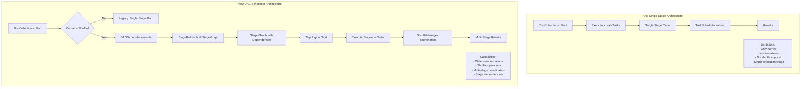
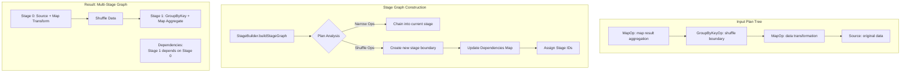
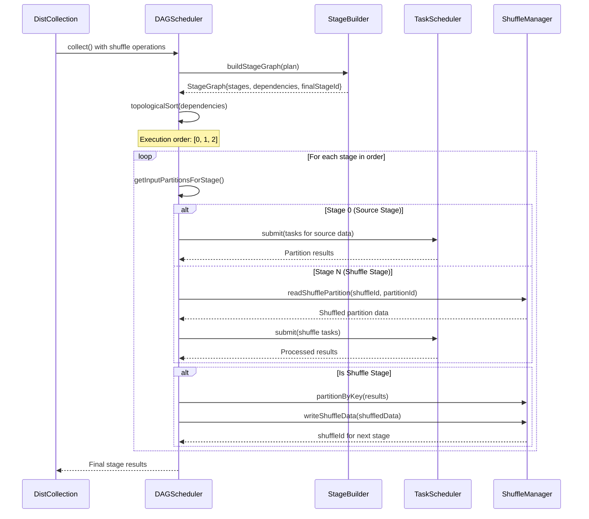
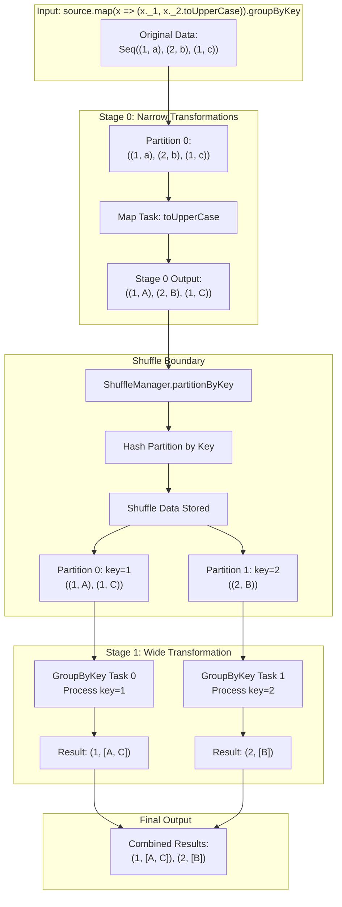
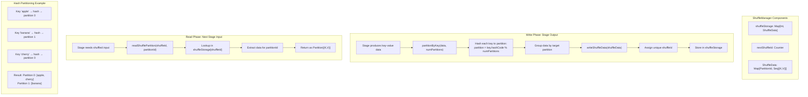
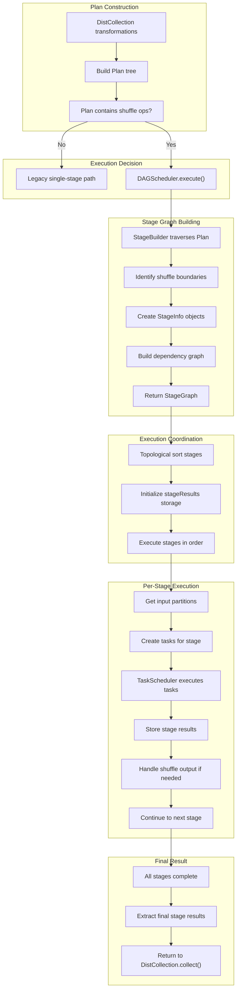

# DAG Scheduler Data Flow Diagrams

## Overall Architecture

## Stage Graph Construction

## Detailed Execution Flow

## Concrete Data Flow

## Types of Stages 

## ShuffleManager

## Complete E2E Execution
