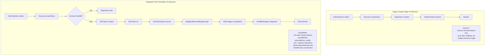
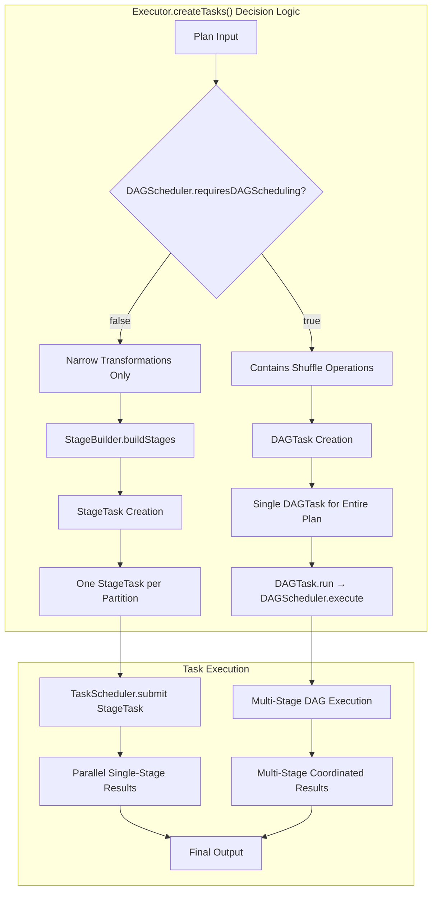
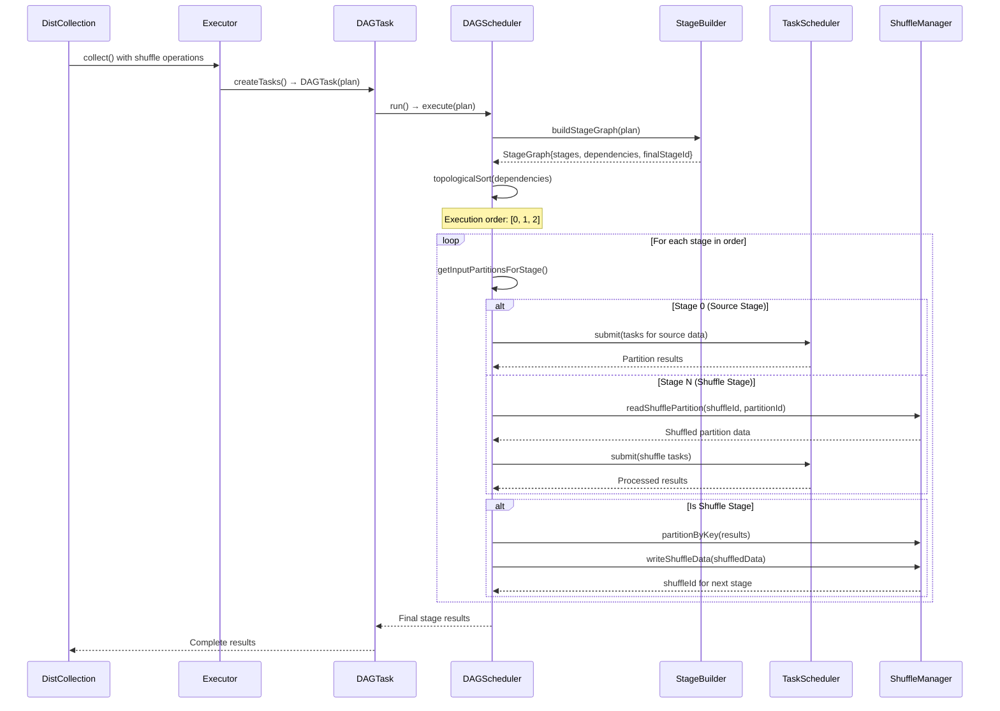
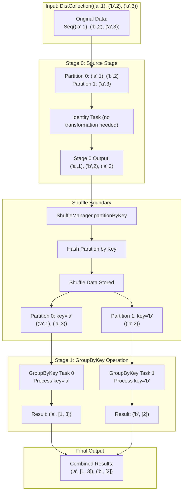
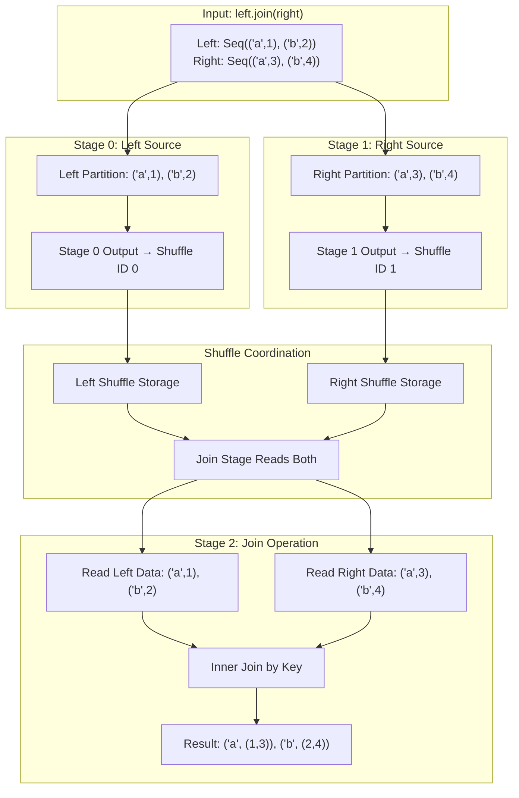
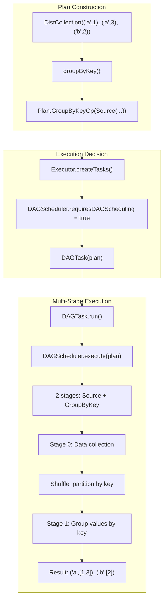
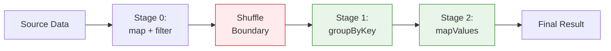

# DAG Scheduler Data Flow Diagrams

## Overall Architecture



## Task Integration Architecture



## Stage Graph Construction


## Detailed Execution Flow



## Supported Shuffle Operations

### GroupByKey Operation


### Join Operation


## ShuffleManager Operations

```mermaid
graph TD
    subgraph "ShuffleManager Components"
        A["shuffleStorage: Map[Int, ShuffleData]"]
        B["nextShuffleId: AtomicInteger"]
        C["ShuffleData: Map[PartitionId, Seq[(K,V)]]"]
    end
    
    subgraph "Write Phase: Stage Output"
        D["Stage produces key-value data"] --> E["partitionByKey(data, numPartitions)"]
        E --> F["Hash each key to partition:<br/>partition = key.hashCode % numPartitions"]
        F --> G["Group data by target partition"]
        G --> H["writeShuffleData(shuffleData)"]
        H --> I["Assign unique shuffleId"]
        I --> J["Store in shuffleStorage"]
    end
    
    subgraph "Read Phase: Next Stage Input"
        K["Stage needs shuffled input"] --> L["readShufflePartition(shuffleId, partitionId)"]
        L --> M["Lookup in shuffleStorage[shuffleId]"]
        M --> N["Extract data for partitionId"]
        N --> O["Return as Partition[(K,V)]"]
    end
    
    subgraph "Multi-Shuffle Join Support"
        P["Join Stage"] --> Q["Read from multiple shuffle IDs"]
        Q --> R["Left: readShufflePartition(shuffleId=0, partitionId)"]
        Q --> S["Right: readShufflePartition(shuffleId=1, partitionId)"]
        R --> T["Separate left/right data for join"]
        S --> T
    end
```



## Complete E2E Execution with Examples

### Example 1: GroupByKey


### Example 2: Complex Pipeline
```scala
// User code:
val result = DistCollection(data)
  .map(transform)      // Narrow - Stage chaining
  .filter(predicate)   // Narrow - Stage chaining  
  .groupByKey()        // Wide - Shuffle boundary
  .mapValues(aggregate) // Narrow - New stage after shuffle
  .collect()
```



## Performance Characteristics

### Single-Stage Path (Narrow Operations)
- **Memory**: Minimal - operations pipelined in single pass
- **Network**: None - no data movement between partitions  
- **Parallelism**: High - each partition processes independently
- **Latency**: Low - direct execution path

### Multi-Stage Path (Wide Operations)  
- **Memory**: Moderate - shuffle data temporarily stored
- **Network**: Shuffle data redistribution between stages
- **Parallelism**: High - stages execute in parallel where possible
- **Latency**: Higher - coordination overhead and shuffle I/O
- **Throughput**: Optimized through stage pipelining

## Implementation Status

| Operation | Status | Notes |
|-----------|--------|-------|
| `groupByKey` | Fully Implemented | Groups values by key with shuffle |
| `reduceByKey` | Fully Implemented | Reduces values by key with shuffle |
| `sortBy` | Fully Implemented | Sorts elements by key function |
| `join` | Fully Implemented | Inner joins with dual shuffle read |
| `cogroup` | Implemented | Basic co-group functionality |
| Multi-stage coordination | Fully Operational | DAGScheduler handles dependencies |
| Shuffle management | Fully Operational | Hash partitioning and storage |
| Task integration | Complete | Seamless DAGTask → DAGScheduler routing |