# Architecture

## Processing Core

The core processing engine is composed of four layers: a logical planning layer, a stage layer, a task layer, and a DistCollection layer. The system now supports both **narrow transformations** (single-stage execution) and **wide transformations** (multi-stage execution with shuffle operations).

### 1. Planning Layer

- Lazy, immutable representation of what will be computed.
- Essentially a declarative statement for what operations are applied, organized into a computation graph
- Uses `PlanWide` module for centralized wide operation detection

```scala
// This creates a Plan tree, no computation happens yet
val plan = Plan.MapOp(
  Plan.FilterOp(
    Plan.Source(partitions), 
    x => x > 2
  ), 
  x => x * 2
)
```

### 2. Stage Layer

- Groups narrow transformations together for efficient execution
- Each stage can execute multiple operations in a single pass over the data
- Stage boundaries occur at wide transformations (shuffles) or unions

```scala
// A stage that chains map and filter operations
val stage = Stage.ChainedStage(
  Stage.map(x => x * 2),
  Stage.filter(x => x > 4)
)
val result = stage.execute(partition) // Executes both operations in one pass
```

### 3. Task Layer

- Computation is broken down into actual execution units over a single piece of data (partition). One task always runs on exactly one partition.
- **Two types of tasks** for different execution patterns:
  - **`StageTask`**: Executes single stages with narrow transformations
  - **`DAGTask`**: Orchestrates multi-stage execution through DAGScheduler for shuffle operations
- Computation is actually triggered with `task.run()`

```scala
// Narrow transformations - single stage
val stageTask = Task.StageTask(partition, stage)
val result = stageTask.run()

// Wide transformations - multi-stage DAG execution  
val dagTask = Task.DAGTask(plan)
val result = dagTask.run() // Executes entire DAG via DAGScheduler
```

### 4. DistCollection Layer (User API)

- High-level API that users interact with

```scala
val dc = DistCollection(data, 2)
  .map(_ * 2)        // Creates Plan.MapOp (narrow)
  .filter(_ > 4)     // Creates Plan.FilterOp (narrow) 
  .groupByKey()      // Creates Plan.GroupByKeyOp (wide - triggers shuffle)
  .collect()         // Triggers execution via appropriate Tasks
```

## Dual Execution Paths

The system uses `PlanWide.isWide()` to intelligently route operations through two execution paths:

### Path 1: Single-Stage Execution (Narrow Transformations)
**Used for:** `map`, `filter`, `flatMap`, `distinct`, `union`, key-value operations without shuffling

```
Plan → Executor.createTasks() → StageTask → TaskScheduler → Results
```

### Path 2: Multi-Stage Execution (Wide Transformations) 
**Used for:** `groupByKey`, `reduceByKey`, `sortBy`, `join`, `cogroup`

```
Plan → Executor.createTasks() → DAGTask → DAGScheduler → Multi-Stage Coordination → Results
```

## Example Walkthrough

### Narrow Transformations Example
User writes code with DistCollection API
```scala
// User code:
val result = DistCollection(Seq(1,2,3,4), 2)
  .map(_ * 2)
  .filter(_ > 4)
  .collect()
```

Step 1: Plan Creation
```scala
// DistCollection.map() creates:
Plan.MapOp(Plan.Source([Partition([1,2]), Partition([3,4])]), x => x * 2)

// DistCollection.filter() creates:
Plan.FilterOp(Plan.MapOp(...), x => x > 4)
```

Step 2: Task Creation & Execution
```scala
// Executor.createTasks() detects narrow-only plan
// Creates one StageTask per partition with chained operations:
val stage = Stage.ChainedStage(
  Stage.map(x => x * 2),
  Stage.filter(x => x > 4)
)
val tasks = [
  StageTask(Partition([1,2]), stage),
  StageTask(Partition([3,4]), stage)
]
```

Step 3: Task Execution
```scala
// Each task runs the entire stage independently:
task1.run() // Stage on [1,2] -> map -> [2,4] -> filter -> [4]
task2.run() // Stage on [3,4] -> map -> [6,8] -> filter -> [6,8]
// Results are combined and returned to `result`
```

### Wide Transformations Example
```scala
// User code with shuffle operation:
val result = DistCollection(Seq(("a",1), ("b",2), ("a",3)), 2)
  .groupByKey()
  .collect()
```

Step 1: Plan Creation
```scala
Plan.GroupByKeyOp(Plan.Source([Partition([("a",1), ("b",2)]), Partition([("a",3)])]))
```

Step 2: DAG Task Creation
```scala
// Executor.createTasks() detects shuffle operation
// Routes through DAGScheduler:
val dagTask = Task.DAGTask(plan)
```

Step 3: Multi-Stage Execution
```scala
// DAGTask.run() triggers:
// 1. StageBuilder.buildStageGraph() - creates stage dependency graph
// 2. DAGScheduler.execute() - coordinates multi-stage execution
// 3. ShuffleManager - handles data redistribution
// Result: [("a", [1,3]), ("b", [2])]
```

### Updated Execution Flow Diagram

```mermaid
flowchart TD
    %% User API Layer (Lazy)
    User["`**User Code**
    DistCollection(data, 2)
    .map(_ * 2)
    .groupByKey()`"]
    
    %% Planning Layer (Lazy)
    subgraph Lazy["🔄 Lazy Evaluation Phase"]
        DC1["`**DistCollection.map()**
        Creates Plan.MapOp`"]
        DC2["`**DistCollection.groupByKey()**
        Creates Plan.GroupByKeyOp`"]
        PlanTree["`**Plan Tree Built**
        GroupByKeyOp(MapOp(Source(...)))`"]
    end
    
    %% Execution Trigger
    Trigger["`**🚀 EXECUTION TRIGGER**
    .collect() called`"]
    
    %% Execution Decision
    Decision{"`**Contains Shuffle?**
    PlanWide.isWide()`"}
    
    %% Single-Stage Path
    subgraph SingleStage["⚡ Single-Stage Execution"]
        Executor1["`**Executor.createTasks()**`"]
        StageBuilder1["`**StageBuilder.buildStages()**
        Groups narrow transformations`"]
        StageTasks["`**StageTask Creation**
        One per partition`"]
        
        subgraph ParallelSingle["🔄 Parallel StageTask Execution"]
            StageTask1["`**StageTask 1**
            Single-pass execution`"]
            StageTask2["`**StageTask 2**
            Single-pass execution`"]
        end
    end
    
    %% Multi-Stage Path  
    subgraph MultiStage["⚡ Multi-Stage Execution"]
        Executor2["`**Executor.createTasks()**`"]
        DAGTaskCreate["`**DAGTask Creation**
        Encapsulates entire DAG`"]
        DAGExecution["`**DAGTask.run()**
        Triggers DAGScheduler`"]
        StageBuilder2["`**StageBuilder.buildStageGraph()**
        Creates stage dependencies`"]
        DAGScheduler["`**DAGScheduler.execute()**
        Multi-stage coordination`"]
        ShuffleManager["`**ShuffleManager**
        Data redistribution`"]
    end
    
    Results["`**Results Combined**
    Final output`"]
    
    %% Flow connections
    User --> DC1
    DC1 --> DC2
    DC2 --> PlanTree
    PlanTree --> Trigger
    
    Trigger --> Decision
    Decision -->|"No (Narrow Only)"| Executor1
    Decision -->|"Yes (Contains Shuffle)"| Executor2
    
    %% Single-stage flow
    Executor1 --> StageBuilder1
    StageBuilder1 --> StageTasks
    StageTasks --> StageTask1
    StageTasks --> StageTask2
    StageTask1 --> Results
    StageTask2 --> Results
    
    %% Multi-stage flow
    Executor2 --> DAGTaskCreate
    DAGTaskCreate --> DAGExecution
    DAGExecution --> StageBuilder2
    StageBuilder2 --> DAGScheduler
    DAGScheduler --> ShuffleManager
    ShuffleManager --> Results
    
    %% Styling
    classDef lazy fill:#e1f5fe,stroke:#01579b,stroke-width:2px
    classDef execution fill:#fff3e0,stroke:#e65100,stroke-width:2px
    classDef trigger fill:#f3e5f5,stroke:#4a148c,stroke-width:3px
    classDef parallel fill:#e8f5e8,stroke:#2e7d32,stroke-width:2px
    classDef decision fill:#ffebee,stroke:#c62828,stroke-width:3px
    
    class DC1,DC2,PlanTree lazy
    class Executor1,StageBuilder1,StageTasks,Executor2,DAGTaskCreate,DAGExecution,StageBuilder2,DAGScheduler,ShuffleManager execution
    class Trigger trigger
    class StageTask1,StageTask2 parallel
    class Decision decision
```


## Stage Boundaries

Stages group **narrow transformations** together for efficiency using centralized wide operation detection via `PlanWide.isWide()`. Stage boundaries occur at:

### Wide Transformations
Operations requiring data shuffling across partitions:
- **`groupByKey`** - Groups values by key: `(K, V) → (K, Iterable[V])`
- **`reduceByKey`** - Reduces values by key: `(K, V) → (K, V)` 
- **`sortBy`** - Sorts elements by key function: `A → Seq[A]`
- **`join`** - Inner joins two collections: `(K, V), (K, W) → (K, (V, W))`
- **`cogroup`** - Co-groups collections: `(K, V), (K, W) → (K, (Iterable[V], Iterable[W]))`

### Union Operations
```scala
val left = collection1.map(_ * 2)   // Stage 1
val right = collection2.filter(_ > 0) // Stage 2  
val union = left.union(right)       // Creates separate stages
```

### Benefits of Stages

1. **Efficiency**: Multiple operations execute in a single pass over data
2. **Memory**: Intermediate results don't need to be materialized 
3. **Parallelism**: Each stage runs independently across partitions
4. **Shuffle Coordination**: Multi-stage execution handles complex data dependencies

```scala
// Narrow transformations: 1 pass executing all operations
data.map(f1).map(f2).filter(p) // → Single StageTask

// Wide transformations: Multi-stage coordination  
data.map(f1).groupByKey.map(f2) // → DAGTask → Multi-stage execution
```

## Supported Operations

### Narrow Transformations (Single-Stage)
- **Transformations**: `map`, `filter`, `flatMap`, `distinct`
- **Key-Value**: `keys`, `values`, `mapValues`, `filterKeys`, `filterValues`, `flatMapValues`
- **Combining**: `union`

### Wide Transformations (Multi-Stage)  
- **Aggregations**: `groupByKey`, `reduceByKey`, `sortBy`
- **Joins**: `join`, `cogroup`

### Actions
- **Collection**: `collect`, `count`, `take`, `first`  
- **Aggregation**: `reduce`, `fold`, `aggregate`, `forEach`
