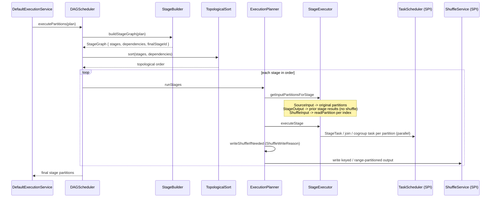

# DAG Scheduler

The `DAGScheduler` is the single execution entry point. Every plan — narrow or wide — is
compiled into a stage graph and executed through it. There is no separate narrow path.

## Responsibilities

1. Compile the plan into a `StageGraph` via `StageBuilder.buildStageGraph` (narrow-only plans
   become a one-stage graph).
2. Compute the execution order with `TopologicalSort` over all stages (stages without dependency
   edges run as-is).
3. Drive stage execution through `ExecutionPlanner`, collecting per-stage outputs.
4. Expose two results: `execute` (flattened elements) and `executePartitions` (partition
   boundaries preserved — used by partition-aware actions such as `aggregate`).

## Execution flow

## Wide operation dispatch

`StageExecutor` executes a shuffle stage by pattern-matching on its `WideOp` record — never on
core `Plan` nodes:

| WideOp | Execution |
|---|---|
| `GroupByKeyWideOp` | `Stage.groupByKeyLocal` as one `StageTask` per shuffle partition |
| `ReduceByKeyWideOp[V]` | `Stage.reduceByKeyLocal` as one `StageTask` per shuffle partition |
| `SortByWideOp[A, S]` | `Stage.sortLocal` as one `StageTask` per range partition; collect concatenates in order |
| `JoinWideOp` | Side-tagged dual shuffle read; strategy per `SimpleWideOpMeta.joinStrategy` or auto-selection |
| `CoGroupWideOp` | `CogroupTask` per co-located left/right shuffle partition |
| `RepartitionWideOp` / `CoalesceWideOp` | Unwrap `(element, Unit)` pairs written by the repartition shuffle |
| `PartitionByWideOp` | Identity pass-through — the key-hash partitioning happened in the shuffle write |

Unknown or missing wide operations fail loudly (`IllegalStateException`); there is no silent
fallback.

## Shuffle writes between stages

A stage's output is written to the shuffle service only when a dependent stage is a shuffle
stage. `ShuffleWriteReason.forDependents` picks the write shape by priority, independent of
dependent iteration order:

1. `DownstreamSortBy` — range partitioned (sampling + cut points) so global order survives.
2. `DownstreamPartitionBy(n)` — key-hashed into the partitionBy target count.
3. `DownstreamRepartition(n)` — written into the target count as `(element, Unit)` pairs.
4. `DownstreamShuffle` — default keyed write.

The reason is logged with every write. `TestShuffleWriteReason` pins the priority and its
order-independence.

## Configuration

`SparkletConf` controls shuffle output width (`defaultShufflePartitions`), join strategy
thresholds (`broadcastJoinThreshold`, `enableSortMergeJoin`), sort sampling
(`sortSamplePerPartition`, `sortMaxSample`), and retry behavior (`maxTaskRetries`,
`baseRetryDelayMs`, `maxRetryDelayMs`). Runtime components come from `SparkletRuntime`.
