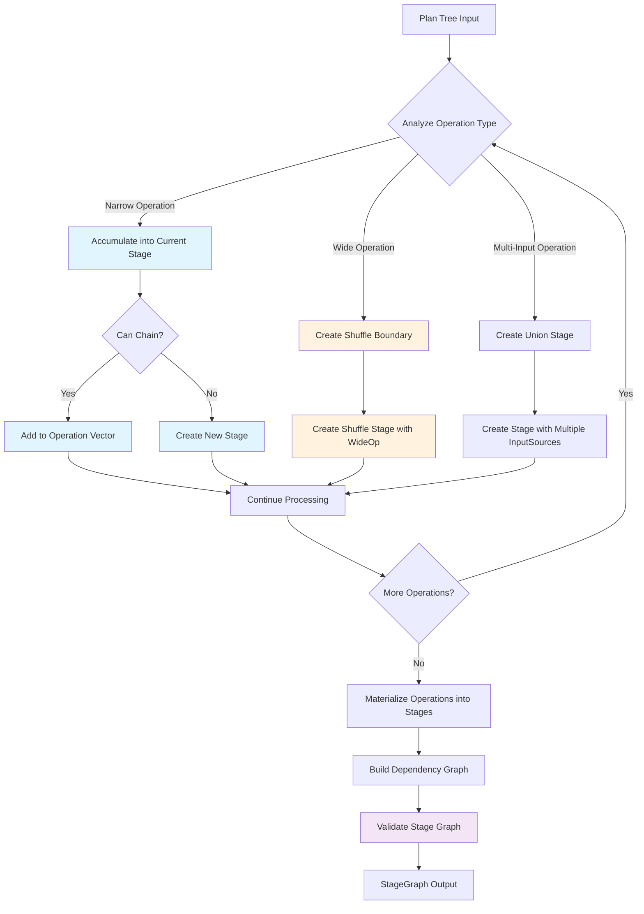

# StageBuilder Architecture

## Overview

The StageBuilder is the central compilation engine in Sparklet that transforms logical plans into executable stage graphs. It bridges the gap between high-level Plan operations and the concrete stages that can be executed by the runtime, handling both narrow transformations (within-partition operations) and wide transformations (shuffle operations requiring data redistribution).

## Stage Builder Flow



## Core Responsibilities

1. Stage Boundary Detection: Identifies where narrow operations can be chained together vs where shuffle boundaries must be created
2. Operation Accumulation: Groups consecutive narrow transformations into single stages for efficient execution  
3. Dependency Graph Construction: Builds the stage dependency graph required for execution ordering
4. Shuffle Planning: Creates shuffle stages with proper input/output metadata for data redistribution
5. Validation: Once the graph is built, validates structural and logical correctness to catch errors early

## Core Components

### StageGraph Model
The primary output representing a complete execution plan:

```scala
case class StageGraph(
  stages: Map[StageId, StageInfo],           // All stages in the graph
  dependencies: Map[StageId, Set[StageId]],  // Stage dependency relationships
  finalStageId: StageId                      // The final stage to execute
)
```

### StageInfo Structure
Metadata about each stage in the execution graph:

```scala
case class StageInfo(
  id: StageId,
  stage: Stage[_, _],                        // Executable stage implementation
  inputSources: Seq[InputSource],            // Where this stage reads data from
  isShuffleStage: Boolean,                   // Whether this is a shuffle stage
  shuffleOperation: Option[Plan[_]],         // Original plan for shuffle stages
  outputPartitioning: Option[Partitioning]   // Output partitioning metadata
)
```

## InputSource Types

Describes where stages get their input data:

### SourceInput
```scala
case class SourceInput(partitions: Seq[Partition[_]])
```
- Reads from original data partitions
- Used for base data sources

### ShuffleInput
```scala
case class ShuffleInput(
  stageId: StageId,           // Upstream stage producing shuffle data
  side: Option[Side],         // Left/Right for multi-input ops (join/cogroup)
  numPartitions: Int          // Expected partition count
)
```
- Reads from shuffle output of upstream stages
- Side tagging disambiguates multi-input operations

### StageOutput
```scala
case class StageOutput(stageId: StageId)
```
- References runtime output of previously computed stages
- Used for operations like union that concatenate upstream results without reshuffling

## Stage Construction Algorithm

### Core Builder Method

The StageBuilder uses a recursive algorithm that processes Plan trees and accumulates operations into stages:

```scala
def buildStageGraph[A](plan: Plan[A]): StageGraph = {
  val ctx = BuildContext(0)                                      // Stage ID generator
  val builderMap = mutable.Map[StageId, StageDraft]()           // Accumulating stages
  val dependencies = mutable.Map[StageId, mutable.Set[StageId]]() // Dependency tracking
  
  val (finalStageId, _) = buildStagesFromPlan(ctx, plan, builderMap, dependencies)
  
  // Convert drafts to final stages and validate
  materializeStages(builderMap, dependencies, finalStageId)
}
```

### Operation Categories

The builder handles three main categories of Plan operations:

#### Narrow Transformations (Chainable)
Operations that don't require data shuffling and can be accumulated into single stages:
- **Basic**: `map`, `filter`, `flatMap`, `distinct`, `mapPartitions`
- **Key-Value**: `keys`, `values`, `mapValues`, `filterKeys`, `filterValues`, `flatMapValues`
- **Local Aggregations**: `groupByKeyLocal`, `reduceByKeyLocal` (when shuffle can be bypassed)

#### Wide Transformations (Shuffle Boundaries)
Operations requiring data redistribution across partitions:
- **Single-Input**: `groupByKey`, `reduceByKey`, `sortBy`, `partitionBy`, `repartition`, `coalesce`
- **Multi-Input**: `join`, `cogroup` (with side tagging for disambiguation)

#### Multi-Input Operations
- **Union**: Combines outputs from multiple stages without shuffling

### Operation Accumulation Strategy

The builder accumulates narrow operations into stages using the `appendOperation` method:

```scala
private def appendOperation(
  ctx: BuildContext,
  sourceStageId: StageId, 
  op: Operation[Any, Any],
  builderMap: mutable.Map[StageId, StageDraft],
  dependencies: mutable.Map[StageId, mutable.Set[StageId]]
): StageId
```

**Chaining Rules**:
- Operations can be chained if the source stage is not a shuffle stage
- Operations can be chained if the stage has a single input source (no multi-input complexity)
- Otherwise, a new stage is created with the operation

## Shuffle Bypass Optimization

The StageBuilder includes sophisticated shuffle bypass logic that can avoid unnecessary shuffles when data is already correctly partitioned:

```scala
if (Operation.canBypassShuffle(groupByKey, src.outputPartitioning, SparkletConf.get)) {
  // Add local groupByKey operation instead of creating shuffle stage
  val resultId = appendOperation(ctx, sourceStageId, 
    GroupByKeyLocalOp[Any, Any](), builderMap, dependencies)
} else {
  // Create shuffle stage for data redistribution
  val shuffleId = createShuffleStageUnified(...)
}
```

**Bypass Conditions**:
- `groupByKey`/`reduceByKey`: When data is already partitioned by key with correct partition count
- `partitionBy`: When target partitioning matches current partitioning  
- `repartition`/`coalesce`: When target partition count matches current count

## Stage Materialization

The builder converts accumulated operations into executable stages using the `materialize` method:

### Single Operation Optimization
```scala
if (ops.length == 1) {
  createStageFromOp(ops.head)  // Direct stage creation, no chaining overhead
}
```

### Operation Chaining
```scala
else {
  ops.foldLeft(createStageFromOp(firstOp)) { (stage, op) =>
    Stage.ChainedStage(stage, createStageFromOp(op))  // Efficient left fold chaining
  }
}
```

## Multi-Input Shuffle Handling

For operations like `join` and `cogroup`, the builder creates shuffle stages with side tagging:

```scala
case joinOp: Plan.JoinOp[_, _, _] =>
  val (leftStageId, _) = buildStagesFromPlan(ctx, joinOp.left, builderMap, dependencies)
  val (rightStageId, _) = buildStagesFromPlan(ctx, joinOp.right, builderMap, dependencies)
  
  val shuffleInputSources = Seq(
    ShuffleInput(leftStageId, Some(Side.Left), numPartitions),
    ShuffleInput(rightStageId, Some(Side.Right), numPartitions)
  )
```

This ensures that during shuffle execution, the DAGScheduler can correctly route data to the appropriate side of the join operation.

## Partitioning Metadata Tracking

The builder maintains partitioning metadata throughout the stage construction process:

```scala
case class Partitioning(byKey: Boolean, numPartitions: Int)
```

**Metadata Evolution**:
- **Preserve**: `map`, `filter`, `flatMap` maintain existing partitioning
- **Key-aware**: `keys`, `values` affect the `byKey` flag appropriately  
- **Create**: Shuffle operations establish new partitioning based on operation semantics
- **Clear**: `union` operations clear partitioning since inputs may have different schemes

## Operation Model

### Narrow Operations
- `MapOp`, `FilterOp`, `FlatMapOp`, `DistinctOp`
- `KeysOp`, `ValuesOp`, `MapValuesOp`, `FilterKeysOp`, `FilterValuesOp`
- `FlatMapValuesOp`, `MapPartitionsOp`
- Local variants: `GroupByKeyLocalOp`, `ReduceByKeyLocalOp`

### Wide Operations (Shuffle Boundaries)
- `GroupByKeyOp`, `ReduceByKeyOp`, `SortByOp`
- `PartitionByOp`, `RepartitionOp`, `CoalesceOp`
- `JoinOp`, `CoGroupOp`

## Partitioning Propagation Rules

| Operation Type | Preserves Partitioning | byKey Behavior | Notes |
|---------------|------------------------|----------------|-------|
| Map/Filter/FlatMap | Preserved | Preserved | No changes |
| Keys | Preserved | Set false | Key-only output |
| Values | Preserved | Set false | Value-only output |
| MapValues/FilterValues | Preserve | Preserve | Structure unchanged |
| Distinct | Preserve | Conditional | Clear if not byKey |
| GroupByKey/ReduceByKey | New | Set true | Creates key-based partitioning |
| SortBy | New | Set false | Range partitioning |
| PartitionBy | New | Set true | Explicit key partitioning |
| Repartition | New | Set false | Hash partitioning |
| Coalesce | New | Set false | Reduced partition count |
| Join/CoGroup | New | Set true | Key-based partitioning |

## WideOp Enumeration

```scala
enum WideOpKind:
  case GroupByKey, ReduceByKey, SortBy, PartitionBy
  case Repartition, Coalesce, Join, CoGroup
```

Each wide operation includes metadata:
- `numPartitions`: Target partition count
- `keyFunc`, `reduceFunc`: Operation-specific functions
- `joinStrategy`: Join algorithm selection
- `sides`: Input ordering for multi-input operations

## Validation System

The StageBuilder includes validation to catch construction errors before execution:

### Graph Structure Validation
- **Existence**: `finalStageId` exists in stages map
- **Dependencies**: All dependency targets exist in stages map
- **Acyclicity**: No circular dependencies using DFS detection
- **Reachability**: All stages reachable from `finalStageId`

### Stage-Specific Validation  
- **ID Monotonicity**: Stage IDs form increasing sequence from 0
- **Shuffle Consistency**: Multi-input shuffles have proper side markers
- **Partitioning Sanity**: Reasonable partition counts and key awareness

### Example Validation Error
```scala
throw new IllegalStateException(
  s"Cycle detected in stage graph involving stage $stageId. " +
  s"Cycle path: ${cyclePath.mkString(" -> ")}. " +
  "This indicates a circular dependency that would prevent execution."
)
```

## Stage Graph Example

For a plan like `source.map(f1).groupByKey.map(f2)`, the StageBuilder produces:

```
Stage 0: Source + map(f1)
  ├─ inputSources: [SourceInput(partitions)]
  ├─ ops: [MapOp(f1)]
  └─ outputPartitioning: Partitioning(byKey=false, numPartitions=2)

Stage 1: GroupByKey + map(f2)  
  ├─ inputSources: [ShuffleInput(stageId=0, side=None, numPartitions=4)]
  ├─ isShuffleStage: true
  ├─ shuffleOperation: Some(GroupByKeyOp(...))
  └─ outputPartitioning: Partitioning(byKey=true, numPartitions=4)

Dependencies: {1 -> Set(0)}
FinalStageId: 1
```

## How to Add New Plan Operations

### Adding Narrow Operations
1. **Create Operation ADT**: Add case class in `Operation` sealed trait
2. **Implement Materialization**: Add pattern match in `materialize()` method
3. **Update Partitioning**: Define `updatePartitioning()` rule
4. **Add Tests**: Verify chaining and partitioning behavior

### Adding Wide Operations
1. **Create WideOp Case Class**: Extend `WideOp` trait
2. **Implement Shuffle Stage**: Add to `createShuffleStageUnified()` method
3. **Define Partitioning**: Set output partitioning based on operation semantics
4. **Add Side Markers**: For multi-input operations, ensure `Side.Left`/`Side.Right` assignment
5. **Update Tests**: Verify shuffle boundary detection and side tagging

### Key Design Principles
- **Immutable Accumulation**: Operations collected in `Vector[Operation]`
- **Late Materialization**: Convert to `Stage` forms only when needed
- **Explicit Side Tagging**: Multi-input operations use stable `Side` markers
- **Post-Build Validation**: Comprehensive invariant checking

## Performance Optimizations

- **Operation Chaining**: Reduces intermediate materialization overhead
- **Shuffle Bypass**: Eliminates unnecessary data redistribution when possible  
- **Dependency Tracking**: Enables optimal execution ordering by DAGScheduler
- **Memory Efficiency**: Uses mutable builders during construction, immutable results
